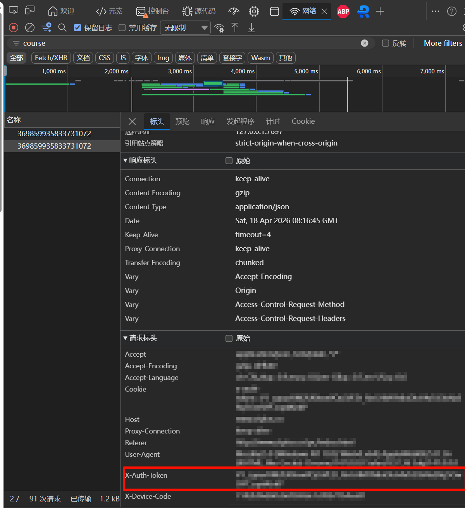
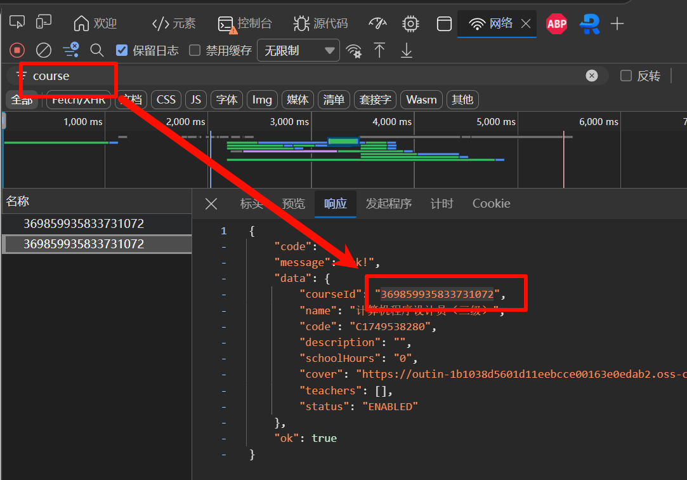

# ZTplus 自动答题与题库更新脚本使用文档

## 简介
这是一个针对 ZTplus 平台的自动答题 Python 脚本。它能够根据本地题库自动完成指定课程下的练习，并在答题出错时自动捕获正确答案以更新本地题库。支持练习列表查看和重答机制。

## 环境依赖
- Python 3.x
- `requests` 库

安装依赖：
```bash
pip install requests
```

## 文件目录结构说明
```text
.
├── auto_answer.py         # 核心自动答题脚本
├── config.json            # 配置文件（存放 Token 等配置）
└── answer/                # 题库文件夹
    ├── 题库1.json
    └── ...
```

## 配置说明
### 1. Token 配置 
脚本需要授权 Token (`x-auth-token`) 才能访问接口。
推荐在项目根目录创建或修改 `config.json` 文件：
```json
{
    "AUTH_TOKEN": "在此处填入你的抓包获取到的 x-auth-token"
}
```
*注：如果不配置此文件，脚本在运行时也会提示你手动输入 `x-auth-token`。*
获取：


### 2. 题库准备
脚本启动时会自动加载 `answer/` 目录下所有的 `.json` 题库文件。
题库 JSON 格式例如：
```json
[
    {
        "question": "题目内容",
        "answer": "A"
    }
]
```

## 使用流程
1. **运行脚本**
   打开终端或命令行，进入脚本所在目录，执行：
   ```bash
   python auto_answer.py
   ```

2. **输入课程 ID**
   脚本运行后，首选提示 `请输入课程 ID:`。你需要输入要处理的课程ID（通常是一串数字，例如 `369859935833731072`）。
   获取：
   

3. **选择要作答的练习**
   脚本将拉取该课程下的所有练习列表，并显示序号、名称、题目数量和当前的完成状态（如：已完成、未完成、未完成(含错题)）。
   ```text
   === 练习列表 ===
   [0] 练习一 (总题: 100, 正确: 90, 错误: 10) - 未完成(含错题)
   [1] 练习二 (总题: 50, 正确: 0, 错误: 0) - 未完成
   ```
   输入对应练习前面的**序号**（如 `0`）按回车。

4. **自动答题及题库更新**
   - 脚本将自动拉取题目并使用本地题库 (`answer/*.json`) 进行比对和提交。
   - 如果遇到**题库中没有的题目**，或**提交后判定为错误的题目**会进行提示。
   - **自动更新题库**：如果提交错误，脚本会自动从接口返回结果中解析正确答案，并**自动覆盖更新**对应 `answer/` 目录下的 JSON 题库文件。

5. **重试机制**
   如果整套试卷答完后，存在“答错的题”（即刚被自动更新了题库）或者“未找到答案的题”，脚本会询问：
   `存在答错并更新题库的情况（或者找不到答案的题），是否重新答题？(y/n):`
   输入 `y` 即可使用刚刚自动修复过的最新题库，重新作答该练习以刷满正确率。如果已经全部正确，程序将直接结束。
